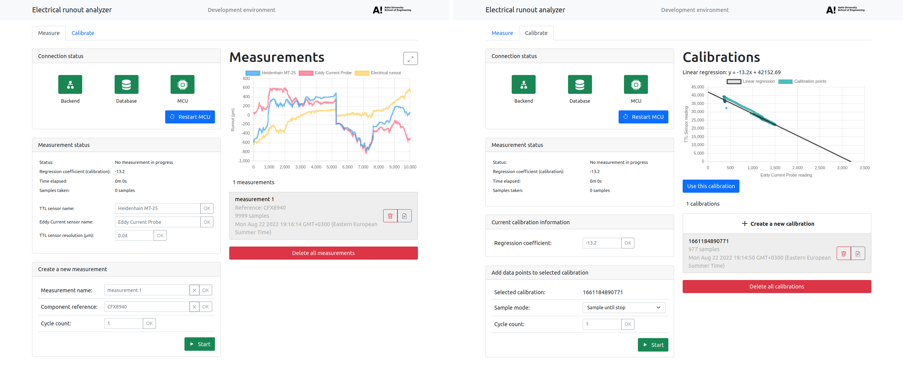

# e-runout



This project is used to measure electrical runout by comparing measurements from touching probe sensors and Eddy current probes simultaneously.

Technologies and frameworks used in the project include Docker, React, Redux, Bootstrap, Node.js, Express, MongoDB and Socket.IO.

### Project structure
[client/](client/)  
Frontend React app code

[documentation/](documentation/)  
Documentation files

[hardware/](hardware/)  
PCB schematics

[mongodb/](mongodb/)  
MongoDB init scripts

[server/](server/)  
Backend Node.js app code

[teensy/](teensy/)  
Teensy microcontroller C++ code

----
## Getting started


### Production

1. Fill out environment variables and rename the .env file:
```sh
$ mv .example.env .env
```

2. Start up the docker-compose stack:
```sh
$ docker-compose up
```

The application creates a Wi-Fi access point with environment variables `SSID` and `PASSPHRASE` given in the `.env` file.

IP address for the application is `10.0.10.1` by default and can be accessed after connecting to the WLAN network.

```
TODO: WAN access is currently not working on the wireless access point
```

### Development

1. Rename the .env file:
```sh
$ mv .env.example .env
```

2. Start up the development database:
```sh
$ docker-compose -f docker-compose.dev.yml up
```

3. Start up the development backend server (in the `server` folder):
```sh
server $ npm install
server $ npm run dev
```

4. Start up the development frontend server (in `client` folder):
```sh
client $ npm install
client $ npm start
```

5. Navigate to the development app at `localhost:3001`. The backend server is accessible from `localhost:3000` and the database admin interface from `localhost:8081`.