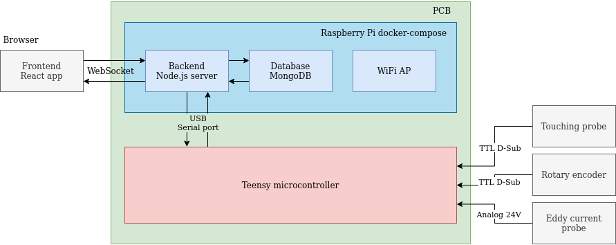

# Architecture

## docker-compose stack

The production `docker-compose` stack consists of three containers:
- `erunout`
- `mongo` [Docker Hub](https://hub.docker.com/_/mongo)
- `rpi-hostap` [Docker Hub](https://hub.docker.com/r/sdelrio/rpi-hostap)

The development `docker-compose` stack consists of two containers:
- `mongo` [Docker Hub](https://hub.docker.com/_/mongo)
- `mongo-express` [Docker Hub](https://hub.docker.com/_/mongo-express)

## erunout

The backend server running on the Raspberry Pi uses WebSockets to communicate with the client. Refer to [AsyncAPI documentation](./asyncapi.yaml) for more detailed information.

## Teensy

The Teensy microcontroller is connected to the Raspberry Pi using USB Serial port.

The TTL signals are connected to Teensy's digital pins supporting hardware quadrature. The analog signal is converted to a digital signal using on-board ADC and passed on to the Teensy using SPI.