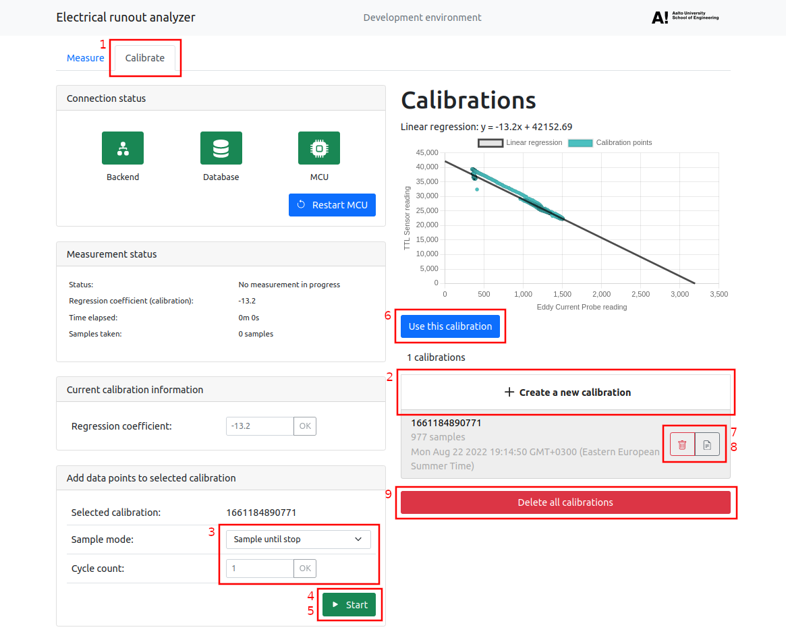
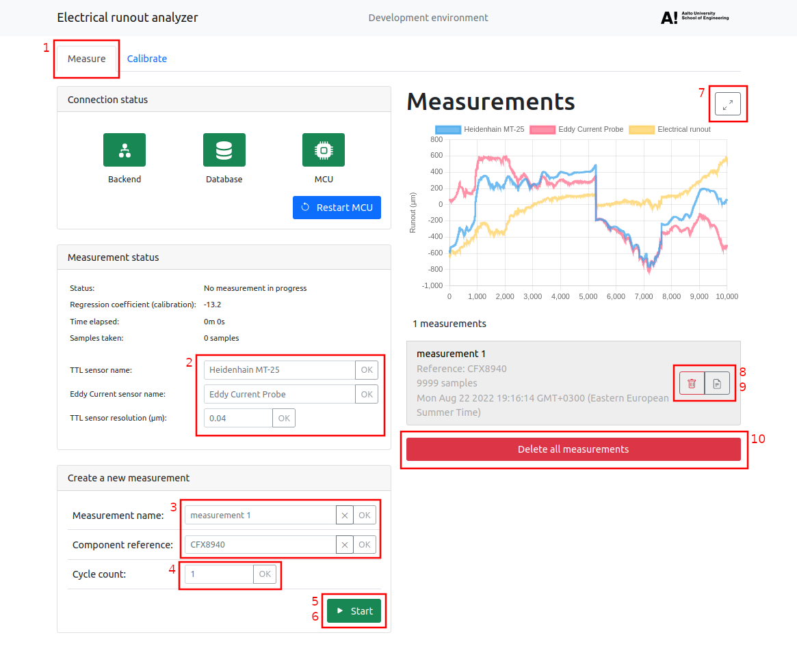

# Creating your first measurement with erunout

## Calibration

When first opening the application, you have to create a calibration. The calibration (regression coefficient) ties your touching probe and Eddy current probe readings together so that they are comparable.



1. Switch to the `Calibrate` tab

2. Click the `Create a new calibration` button and select the created calibration

3. Select a sample mode (and cycle count if sampling using cycles. Remember to click `OK` or press `Enter` to set the value).

4. Click the `Start` button. You can now rotate the measured object and the application will collect data points.

5. Collect data points until the measurement is stopped automatically, or click the `Stop` button to stop the measurement.

6. Click the `Use this calibration` button on the selected calibration. If linear regression cannot be calculated from the data points, the button is disabled. In this case, you can either add more data points to the calibration or create a new calibration.

7. View or save the raw measurement JSON data by clicking the file icon button.

8. Delete a calibration by clicking the trash icon button.

9. Double-click the `Delete all calibrations` button to delete all saved calibrations.

```
NOTE: Eddy current readings near its maximum range are discarded from the linear regression to avoid data points outside of its measuring range to affect the calibration negatively.
```

---

## Measurement

Now that you've set the calibration (regression coefficient), you can create your first measurement.



1. Switch to the `Measure` tab

2. Set `TTL sensor name`, `Eddy current sensor name` and `TTL sensor resolution`. Remember to click `OK` or press `Enter` to set the values.

3. (optional) Set a name for the measurement and a component reference to identify the measured object.

4. Set the cycle count. This will determine the number of full revolutions before the measurement is stopped automatically.

5. Click the `Start` button. You can now rotate the measured object and the application will collect data points.

6. Collect data points until the measurement is stopped automatically, or click the `Stop` button to stop the measurement.

7. You can now select the measurement and view the chart showing runout values. The runout is calculated by substracting average from the dataset and scaled by the `TTL sensor resolution`. You can also expand the chart by clicking the expand button and also print it out when expanded.

8. View or save the raw measurement JSON data by clicking the file icon button.

9. Delete a measurement by clicking the trash icon button.

10. Double-click the `Delete all measurements` button to delete all saved measurements.