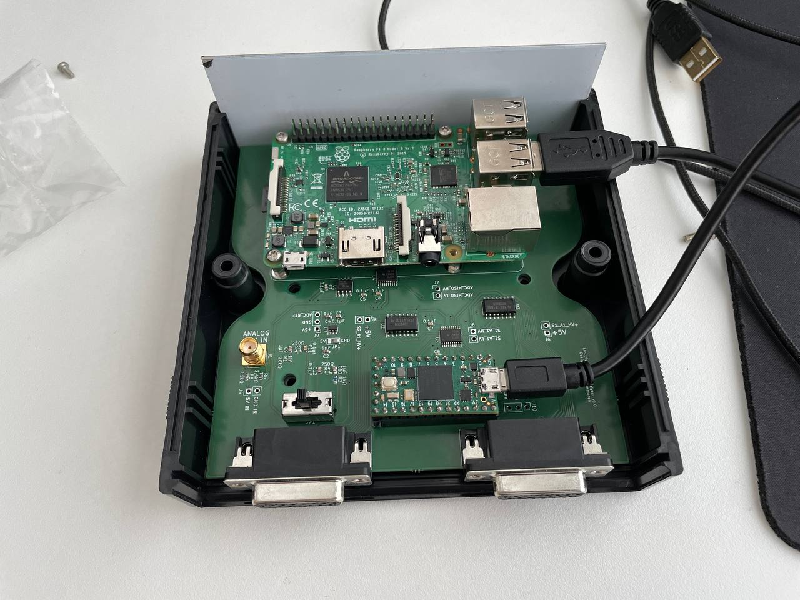

# PCB schematics

This folder contains the KiCad (6.0) schematics for the project. The most recent schematics are named `erun2`. The project file is `erun2.kicad_pro` which is the easiest way to open all the schematics. The wiring diagram is in `erun2.kicad_sch` and PCB in `erun2.kicad_pcb`.

### Data sheets of components used
- [TXB0108PWR](https://www.ti.com/lit/ds/symlink/txb0108.pdf) Voltage level translator (5V->3.3V)
- [MC3486N](https://www.ti.com/lit/ds/symlink/mc3486.pdf) Differential line receiver
- [MCP3301](https://ww1.microchip.com/downloads/aemDocuments/documents/APID/ProductDocuments/DataSheets/21700E.pdf) 13-bit analog-to-digital converter
- [TPS79147DVBT](https://www.ti.com/lit/ds/symlink/tps79147-ep.pdf) Low-dropout regulator (WARNING: These break really easily due to ESD, be careful with these)